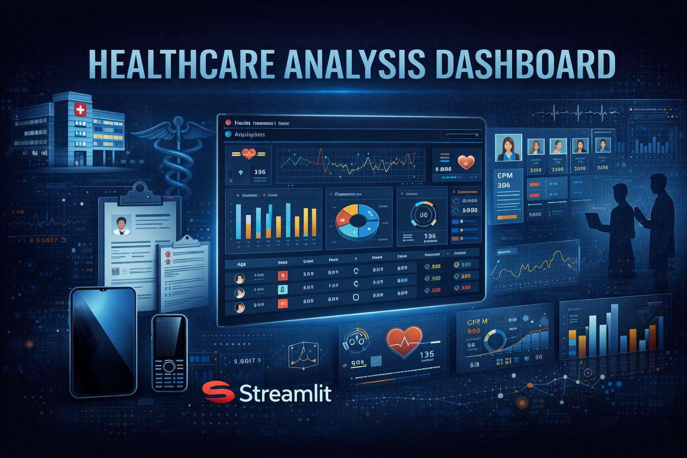
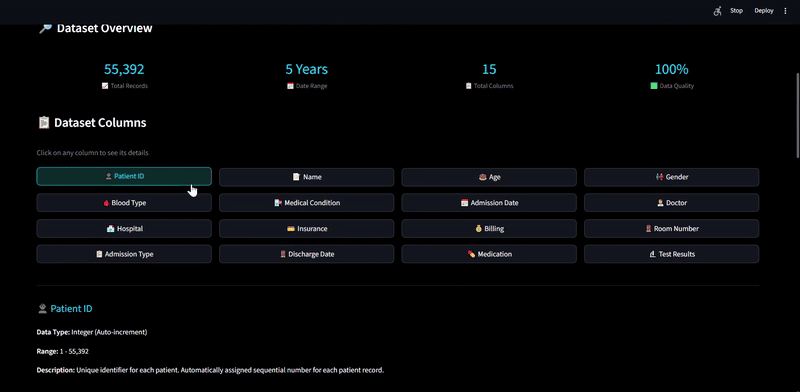
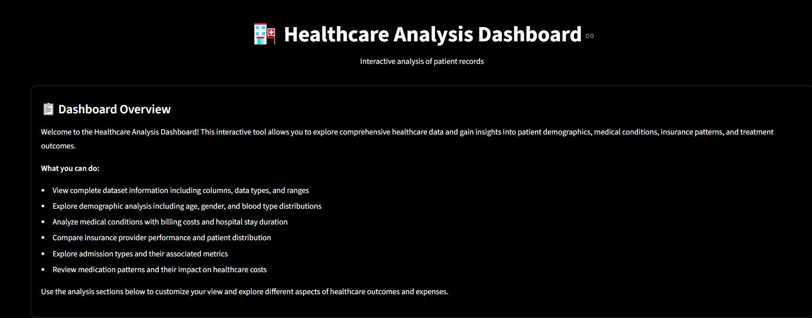
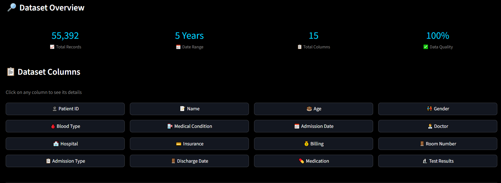
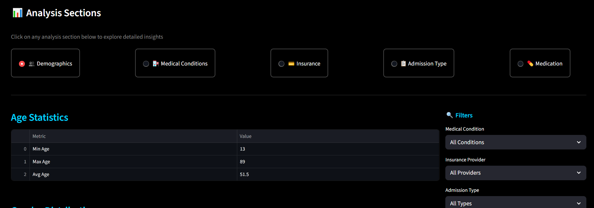
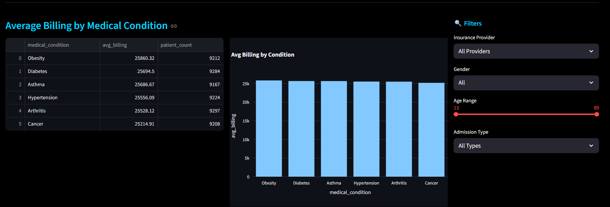

# Healthcare Analysis Dashboard




---

## Overview

This project transforms raw healthcare data into actionable insights through an interactive web-based dashboard built with Streamlit. Analyzing 55,392 patient records across 5 years (2019-2024), the dashboard enables stakeholders to explore patterns in patient demographics, medical conditions, treatment costs, and outcomes without requiring technical expertise. The system processes 40+ optimized SQL queries against a MySQL database with real-time filtering capabilities.

**Business Problem:** Healthcare administrators need data-driven insights to optimize costs, identify treatment patterns, and ensure equitable care delivery, but lack tools to independently explore complex datasets without SQL knowledge or technical dependencies.

---

### Dashboard Demo



*Interactive dashboard showing real-time filtering and visualization updates*

---

## Key Features

- **Interactive multi-page dashboard** with tabbed navigation across 6 analysis sections
- **Real-time filtering** by medical condition, insurance provider, admission type, and gender
- **40+ optimized SQL queries** with SQLAlchemy ORM and caching for sub-second response times
- **Dynamic visualizations** using Plotly charts that update instantly based on user selections
- **Session state management** for seamless multi-filter interactions across analysis sections
- **Responsive two-column layouts** adapting to user selections and displaying comparative metrics
- **Data quality validated** — removed 108 records (0.19%) with negative billing amounts

---

## Dataset

| Property | Detail |
|----------|--------|
| Source | [Kaggle - Healthcare Dataset](https://www.kaggle.com/datasets/prasad22/healthcare-dataset) |
| Size | 55,392 patient admissions (after cleaning) |
| Time Period | May 2019 - May 2024 (5 years) |
| Data Quality | 100% complete (no missing values) |
| Records Removed | 108 (0.19%) with negative billing amounts |

### Data Categories

**Patient Demographics:**
- Age: 13-89 years (Average: 51.5)
- Gender: 50.2% Male, 49.8% Female
- Blood Type: 8 types

**Medical Information:**
- Medical Conditions: 6 types (Cancer, Diabetes, Hypertension, Obesity, Asthma, Arthritis)
- Medications: 5 types
- Test Results: Normal/Abnormal/Inconclusive

**Admission Details:**
- Admission Types: Emergency, Elective, Urgent
- Hospital Stay: 15-16 days average
- 40,341 unique doctors, 39,876 unique hospitals

**Financial:**
- Billing Range: $9.24 - $52,764.28
- Average: $25,540 across all conditions

---

## Tech Stack

- **Python 3.9+**
- **Streamlit** — interactive web dashboard framework
- **MySQL** — patient records database (55,392 records)
- **SQLAlchemy** — ORM for database queries with caching
- **Pandas** — data manipulation and transformation
- **Plotly** — interactive visualizations
- **Python-dotenv** — environment variable management

---

## Installation

```bash
# Clone the repository
git clone https://github.com/yourusername/healthcare-analysis-dashboard.git
cd healthcare-analysis-dashboard

# Install dependencies
pip install -r requirements.txt

# Set up environment variables
cp .env.example .env
# Edit .env with your MySQL credentials:
# DB_USER=your_username
# DB_PASSWORD=your_password
# DB_HOST=localhost
# DB_NAME=healthcare_db

# Run the dashboard
streamlit run healthcare_dashboard.py
```

The dashboard will open at `http://localhost:8501`

---

## Project Structure

```
healthcare-analysis-dashboard/
├── README.md
├── requirements.txt
├── .env.example
├── healthcare_dashboard.py (main application)
├── dataset/
│   └── healthcare_data.csv
├── sql/
│   └── schema.sql (database setup)
└── images/
    ├── banner.png
    ├── dashboard_demo.gif
    ├── dashboard_welcome.png
    ├── dashboard_overview.png
    ├── demographics_analysis.png
    └── medical_conditions_analysis.png
```

---

## Dashboard Features

### 1. Dataset Overview
- Summary statistics: 55,392 records, 15 columns, 5-year timespan
- Column details with data types, ranges, and descriptions
- Interactive column explorer for data dictionary access

### 2. Demographics Analysis
- Age distribution across medical conditions
- Gender-based billing comparison
- Blood type distribution patterns
- Filtered statistics by patient characteristics

### 3. Medical Conditions Analysis
- Patient count by condition (6 conditions tracked)
- Average billing by condition ($644 spread across conditions)
- Test result distribution (Normal/Abnormal/Inconclusive)
- Condition-specific admission patterns

### 4. Insurance Analysis
- Patient distribution across 5 insurance providers
- Cost comparison by insurance type (< 1% variation)
- Provider-specific utilization metrics

### 5. Admission Type Analysis
- Emergency vs Elective vs Urgent admissions
- Cost by admission type ($105 maximum spread)
- Hospital stay duration patterns (15-16 days average)

### 6. Medication Analysis
- Medication usage distribution across 5 medications
- Cost by medication ($394 difference: Ibuprofen vs Lipitor)
- Medication-condition correlations

---

## Key Insights

### 1. Exceptional Cost Standardization
**Finding:** Billing costs vary by only $644 (2.5%) across all 6 medical conditions and less than 1% across insurance providers and admission types.

**Impact:** Enables highly predictable budgeting and resource planning, though may mask underlying treatment complexity differences requiring investigation.

### 2. Gender-Based Billing Pattern
**Finding:** Consistent $137 higher billing (0.54%) for one gender across all conditions, insurance types, and admission types.

**Impact:** Warrants investigation for potential treatment pathway differences or equity concerns in care delivery protocols.

### 3. Cancer Treatment Cost Anomaly
**Finding:** Cancer shows lowest average billing ($25,162) despite typically being among the most expensive conditions to treat.

**Impact:** Suggests potential data collection gaps or exceptional cost efficiency requiring validation against industry benchmarks.

### Visualizations

**1. Dashboard Welcome Screen**
Landing page introducing the dashboard capabilities with clear navigation to all analysis sections.



**2. Dataset Overview**
Summary statistics showing 55,392 records, 5-year timespan, 15 columns, and 100% data quality with interactive column explorer.



**3. Demographics Analysis**
Age distribution statistics with interactive filters for medical condition, insurance provider, and admission type allowing drill-down analysis.



**4. Medical Conditions Analysis**
Billing comparison across 6 medical conditions with data table and interactive bar chart showing cost patterns and patient counts.



---

## Business Recommendations

**1. Investigate Gender-Based Billing Variance**
- Analyze treatment protocols and procedure selection by gender
- Expected Impact: Ensure equitable care delivery and identify protocol optimization opportunities

**2. Validate Cancer Treatment Costs**
- Verify data completeness and benchmark against industry standards
- Expected Impact: Confirm data quality or uncover cost efficiency opportunities

**3. Implement Predictive Analytics**
- Build patient outcome forecasting models and real-time monitoring dashboards
- Expected Impact: Enable proactive intervention and operational efficiency improvements

---

## Data Quality Notes

**Synthetic Dataset Characteristics:** This analysis uses a synthetic dataset generated for educational purposes. Real healthcare data typically shows:
- Greater cost variation across conditions (5-15% vs 2.5%)
- More pronounced demographic skews
- Uneven admission type distributions
- Stronger condition-based cost differences

The project demonstrates competency with real-world methodologies and tools, but findings should be understood within synthetic data context.

---

## Future Enhancements

- **Machine learning** — patient outcome prediction and risk stratification models
- **External benchmarking** — industry standard comparisons and performance metrics
- **Enhanced variables** — comorbidities, procedures, readmission rates, patient satisfaction scores
- **Advanced features** — role-based access control, PDF exports, cohort analysis, longitudinal tracking
